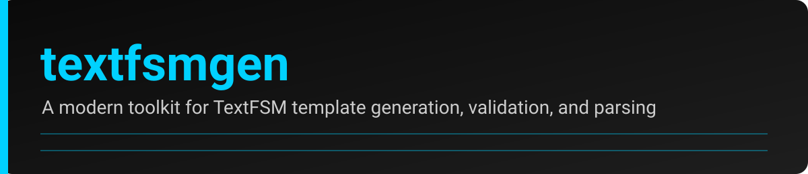

  

# 🚀 Welcome to textfsmgen

**textfsmgen** is a developer‑friendly tool for generating, validating, and maintaining TextFSM templates with clarity, consistency, and automation.

Whether you're a beginner exploring TextFSM or a maintainer managing large template libraries, this documentation gives you everything you need — cleanly organized, easy to scan, and optimized for real‑world workflows.

---

## 🔧 What You Can Do

- Generate TextFSM templates from examples  
- Validate templates with built‑in tooling  
- Use the CLI or Python API  
- Debug parsing issues with structured helpers  
- Follow best practices for maintainable templates  
- Automate releases and CI workflows  

---

## 📘 Documentation Structure

### 🧭 Getting Started
- Installation  
- Quickstart  
- Usage overview  

### 🛠️ Usage
- CLI  
- Python API  
- Examples  
- Debugging  

### 📚 Guides
- Writing templates  
- Best practices  
- Validation  

### 📖 Reference
- API reference  
- Configuration  

### 🧩 Development
- Contributing  
- Release process  
- Architecture  
- Roadmap  

### 🗂️ Maintenance
- Regular Maintenance  
- Testing Maintenance  
- Release Maintenance  
- Deployment Maintenance  

### 🔧 Miscellaneous
- Installing PowerShell 7  

---

## 💡 Tip for Developer‑Citizens

Most commands in this project use **PowerShell 7 (`pwsh`)**.  
If you don’t have it installed, see:

👉 [Installing PowerShell 7](miscellaneous/powershell-install.md)

---

## 🎯 Ready to Begin?

Start with the **Quickstart** to get your first template running in minutes:

👉 [Quickstart](quickstart.md)
